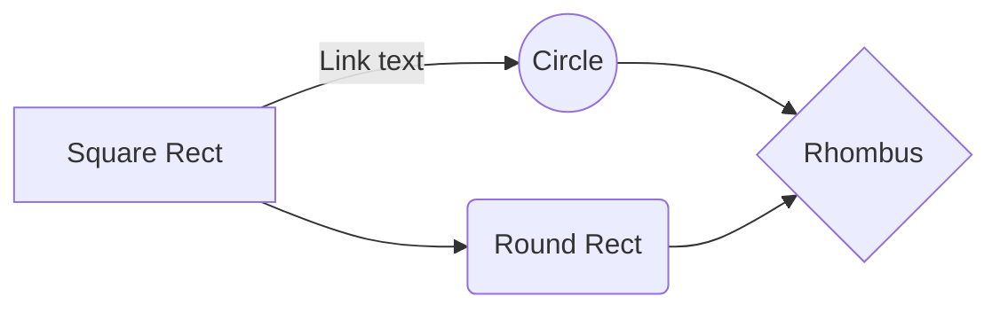

# Welcome to 42

Hi! Here is all my work at [42 Sillicon Valley](https://www.42.us.org/) and [42 Paris](https://www.42.fr/). Most of the projects are in C.

# Projects

| Projects | description | Difficulty | language | state |
|--|--|--|--|--|
| [bc](/calculator-bc-42-master) | Recode the bc command in C | T1 | C | :white_check_mark: |
| [libft](/libft) | C standard library and data structures (linked list, hash table, binary tree, ...) | T1 |C |:white_check_mark: |
| [fillit](/fillit) | Puzzle | T1 | C |:white_check_mark: |
| [get_next_line](/get_next_line) | read line by line any file descriptor | T1 | C |:white_check_mark: |
| [push_swap](/push_swap) | Sorting algorithms | T1 | C |:white_check_mark: |
| [ft_printf](/ft_printf) | syntax tree to understand printf function | T1 | C |:white_check_mark: |
| [ft_select](/ft_select) | Terminal interaction | T1 | C |:white_check_mark: |
| [Taskmaster](/taskmaster) | TCP/IP server to control processes | T1 | Node js |:white_check_mark: |
| [minishell/21sh/42sh](/minishell/21sh/42sh) | Recreate my own shell |  T3 | C |:white_check_mark: |
| [ft_malloc](/ft_malloc) | Recreate paging proccess of malloc, calloc and free | T2 | C |:construction_worker: |

## Tests
- Peer to peer evaluations
- Moulinette
- valgrind for memory leaks

