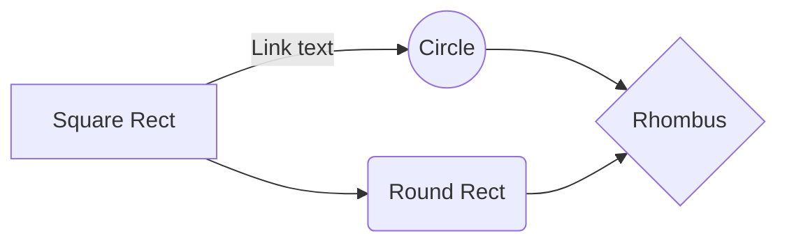

# Welcome to 42

Hi! Here is all my work at [42 Sillicon Valley](https://www.42.us.org/) and [42 Paris](https://www.42.fr/). Most of the projects are in C.

# Projects

| Projects | description | language | state |
|--|--|--|--|
| [bc](/calculator-bc-42-master) | Recode the bc command in C |  C | :white_check_mark: |
| libft | C standard library and data structures (linked list, hash table, binary tree, ...) | C |:white_check_mark: |

## Tests
- Peer to peer evaluations
- Moulinette
- valgrind for memory leaks

